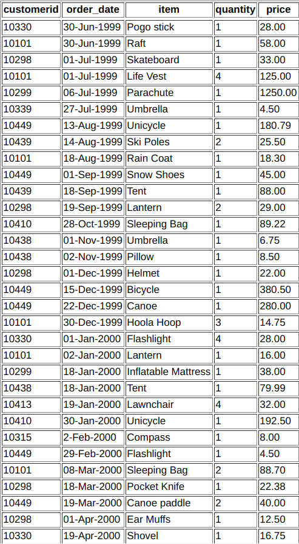
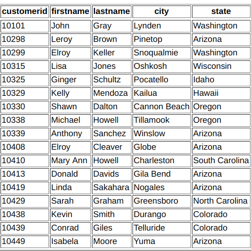

# Week 02 Practice

Table items_ordered

Table cusomters

# Questions

1. From the items_ordered table, select a list of all items purchased for customerid 10449. Display the customerid, item, and price for this customer.
2. Select all columns from the items_ordered table for whoever purchased a Tent.
3. Select the customerid, order_date, and item values from the items_ordered table for any items in the item column that start with the letter "S".
4. Select the distinct items in the items_ordered table. In other words, display a listing of each of the unique items from the items_ordered table.
5. Select the maximum price of any item ordered in the items_ordered table. Hint: Select the maximum price only.
6. Select the average price of all of the items ordered that were purchased in the month of Dec.
7. What are the total number of rows in the items_ordered table?
8. For all of the tents that were ordered in the items_ordered table, what is the price of the lowest tent? Hint: Your query should return the price only.
9. How many people are in each unique state in the customers table? Select the state and display the number of people in each. Hint: count is used to count rows in a column, sum works on numeric data only.
10. From the items_ordered table, select the item, maximum price, and minimum price for each specific item in the table. Hint: The items will need to be broken up into separate groups.
11. How many orders did each customer make? Use the items_ordered table. Select the customerid, number of orders they made, and the sum of their orders. Click the Group By answers link below if you have any problems.
12. How many people are in each unique state in the customers table that have more than one person in the state? Select the state and display the number of how many people are in each if it's greater than 1.
13. From the items_ordered table, select the item, maximum price, and minimum price for each specific item in the table. Only display the results if the maximum price for one of the items is greater than 190.00.
14. How many orders did each customer make? Use the items_ordered table. Select the customerid, number of orders they made, and the sum of their orders if they purchased more than 1 item.
15. Select the lastname, firstname, and city for all customers in the customers table. Display the results in Ascending Order based on the lastname.
16. Same thing as exercise #1, but display the results in Descending order.
17. Select the item and price for all of the items in the items_ordered table that the price is greater than 10.00. Display the results in Ascending order based on the price.
18. Select the customerid, order_date, and item from the items_ordered table for all items unless they are 'Snow Shoes' or if they are 'Ear Muffs'. Display the rows as long as they are not either of these two items.
19. Select the item and price of all items that start with the letters 'S', 'P', or 'F'.
20. Select the date, item, and price from the items_ordered table for all of the rows that have a price value ranging from 10.00 to 80.00.
21. Select the firstname, city, and state from the customers table for all of the rows where the state value is either: Arizona, Washington, Oklahoma, Colorado, or Hawaii.
